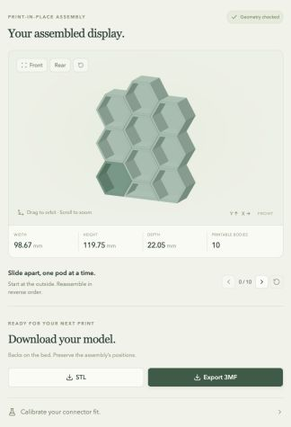

# Honeycomb Workshop

A local, browser-based generator for modular honeycomb display pods. Node serves the editor; Manifold WebAssembly generates the actual printable geometry in a browser worker. The Three.js preview, STL exporter and 3MF exporter use the same meshes.



*Build your layout, customize the connectors, and download a model ready for your slicer.*

## Run locally

Requires Node.js 22.13+ and pnpm. From the repository root:

```sh
pnpm install --frozen-lockfile
pnpm dev
```

Open the Local URL printed in the terminal, normally http://127.0.0.1:3000. On macOS you can also double-click `start-local.command`; it uses an installed Node/pnpm or the Codex bundled runtime when available. Keep that terminal open while using the editor.

For a production build, run `pnpm build`, then `pnpm start`. No account, database, Python service or external geometry API is needed. Dependencies must be installed once; previews and downloads then run on your device. The application is not registered or published to a hosting service.

The app, launcher and package commands live at the repository root. The original Python generator and spline-based exports have been removed; the original design remains in Git history. Current example models and verification reports are in [`generated/`](generated/).

## Single pod

Choose Full or Half and turn each connector on or off. Labels are always viewed from the open front, regardless of the camera angle:

| Edge | Enabled connector |
| --- | --- |
| N, NE, SE | Integrated male dovetail rail |
| S, SW, NW | Female dovetail channel |

The upper-half pod supports N, NE and NW; its bottom is always solid. Off edges are uninterrupted walls. The opening height remains 30 mm, interior depth 19.65 mm, wall thickness 2 mm, back 2.4 mm, and total depth 22.05 mm. The half shape retains the original compartment dimensions. Male rails are recessed behind the front face.

## Editable assembly

Across and Tall specify the number of columns and full-pod cells per column; odd columns are staggered by half a pitch. You can remove and restore cells or replace them with upper-half pods. Click a cell in the diagram or a pod in the 3D preview to edit it.

Neighbors connect automatically. An override on a shared edge changes both sides, while a perimeter edge can be enabled for future expansion. Turning a joint off can produce disconnected groups; export all groups together or choose one group. The generated array is a collection of separate, interlocked solids, never a fused union.

Flat-bottom fillers occupy the half-height gaps below raised columns. Their floors are trimmed by half the wall gap (0.15 mm at the default settings) to share the full pods' bottom plane. Irregular silhouettes may contain gaps too tall for one half filler; the editor reports these instead of stretching a compartment.

The maximum input is 20 × 20, plus applicable base fillers. Check the displayed overall dimensions against your print bed; the generator does not assume a printer size or automatically tile across plates.

## Fit and printing

Default calibration starting points are 0.30 mm between pod walls, 0.30 mm normal clearance per mating connector surface, and 0.40 mm between male tips and female front stops. Use matching settings when mixing individually generated pods and assemblies. Supported adjustment ranges are 0.20–0.80 mm wall gap, 0.15–0.50 mm fit, and 0.20–1.00 mm axial clearance.

Download the calibration ZIPs for 0.20, 0.30 and 0.40 mm connector fits. Each contains three small, filename-labeled STL/3MF pairs and instructions. Print one file at a time to keep the fit samples identified. Separate-fit strips assemble after printing; print-in-place strips start interlocked. Calibrate with your intended printer, material, nozzle and layer profile.

- Print the solid backs on the build plate, with all parts printed layer by layer.
- Keep the supplied relative part positions. In a slicer import the 3MF assembly as one object with multiple parts, not independently arranged objects.
- Keep supports off. Do not apply automatic gap-closing, XY expansion or brims that bridge the joints. Use elephant-foot compensation appropriate to your calibrated setup.
- Check the sliced layers around the first layer, dovetails and front stops. Model clearances are starting points, not guarantees across materials and printers.
- After cooling, use the editor's step-through sequence to slide the next outside pod toward its open front (+Z). Assemble in reverse order. Interior pods are not intended to pull out independently.
- The recessed front stops align the fronts; this is a sliding connection without a snap latch. Physical fit, rigidity and repeated assembly must be checked with your calibration print.

These integrated connectors are not compatible with older loose joining splines. Keep all pods in the shown orientation; rotating an individual pod in the display changes connector compatibility.

## Export formats

STL is a binary mesh with disconnected closed shells and coordinates in millimeters. STL itself has no unit metadata or part hierarchy.

3MF explicitly declares millimeters and stores each pod as a separate mesh component beneath one positioned assembly. It also embeds the configuration and removal order in `Metadata/honeycomb.json`. It is a model file, not a printer-specific slicer project or G-code.

Downloads are unavailable while generation is pending or when collision checks fail. The last generated preview may remain visible during an update. Mesh and pair caches are bounded; old worker results cannot replace a newer configuration.

## Validation and development

```sh
pnpm test
pnpm typecheck
pnpm build
pnpm validate:models
python3 scripts/slice-verify.py # macOS with Bambu Studio installed
python3 scripts/check-exports.py # optional dependencies below
```

The independent export checker uses Python only for verification. Install its optional dependencies in a virtual environment:

```sh
python3 -m venv .venv
.venv/bin/python -m pip install -r scripts/requirements-verify.txt
.venv/bin/python scripts/check-exports.py
```

Generate and slice the sample models before running the checker. Python is not needed to launch the editor or download models.

`validate:models` creates representative STLs, 3MFs, calibration ZIPs and a geometry report under `generated/`. The slicer verifier uses bundled Bambu profiles with PLA, a 0.4 mm nozzle, 0.20 mm layers, three walls, 15% infill and no supports. It does not print or change saved user presets. Temporary slices go under ignored `work/`; its summary is `generated/slicer_report.json`.

Tests cover all 64 full and 8 half connector masks, mating directions and clearances, floor alignment, layout edits and disconnected groups, 20 × 20 generation, continuous removal collisions, and STL/3MF round trips. Continuous +Z removal is checked using the exact swept volume of the back/rails and the later-starting front stops, rather than a few sampled positions.

`lib/model/` owns types, layout, geometry, worker and export logic. `components/workshop/` owns the preview and diagrams. The app uses the Sites starter and its existing controls, with a local Node runtime. The optional, feature-detected WebMCP interface exposes `read_honeycomb_configuration` and `configure_honeycomb` using the same editor state.

Digital verification and slicing do not establish physical fit on your printer. Print and test the calibration samples before committing to a large array.

### Verification completed for this version

All 12 automated tests, type checking, source linting and the production build passed. All 11 representative models imported and sliced successfully. The slicer reported only that the generic model files have no filament colors; no slicing errors occurred.

An independent Python round trip confirms 11 STL/3MF pairs contain matching separate closed bodies. Nominal extrusion envelopes remain separated on seven sampled layers in the two example arrays and three print-in-place calibration fits. The default array retains about 0.296–0.300 mm XY gaps at those layers. See `generated/independent_report.json` for exact measurements. This is a sampled digital toolpath check, not a physical print test.

Browser checks covered connector toggles, full/half selection, shared-edge synchronization, removal/restoration and half substitution, flat fillers, the removal preview, rapid configuration changes, both model downloads, both calibration archives, and valid/invalid WebMCP configuration. The narrow 649 px layout was checked for horizontal overflow. The launcher supports the local bundled runtime on this computer.

The source lint command excludes the untouched generated UI catalog and its mobile hook; it checks the editor and model code. Those starter primitives remain type-checked by TypeScript.

## License

[MIT License](LICENSE). Third-party dependencies retain their own licenses.
The footer serves the same license from `public/LICENSE.txt`; keep it in sync with `LICENSE`.
