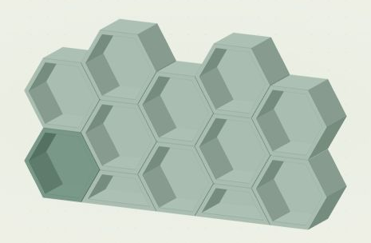
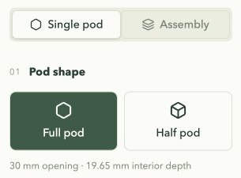
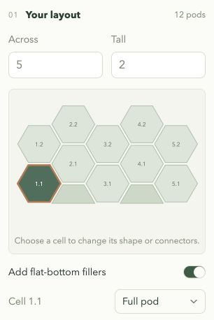
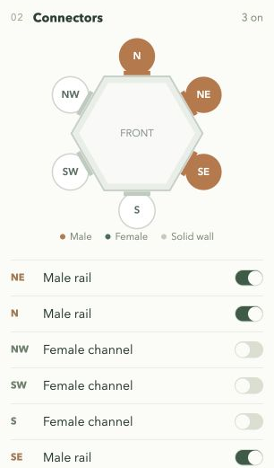
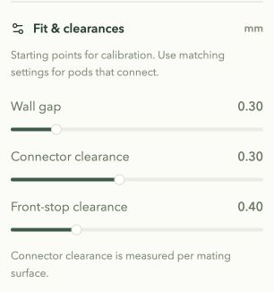
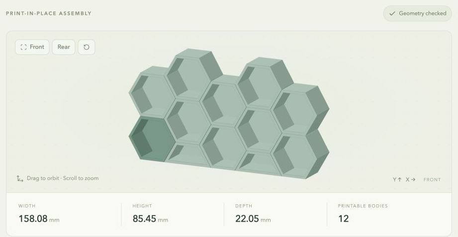
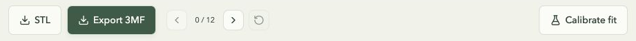
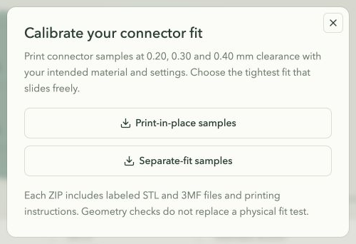

# Honeycomb Workshop

Design a modular honeycomb display, customize its connectors, and download STL or 3MF files for printing. Build one pod or an interlocking assembly, with solid walls wherever connectors are switched off.



*A five-column display generated in the editor: ten full pods and two half fillers. This is a model preview example of what can be generated.*

## Run locally

Requires Node.js 22.13+ and pnpm. From the repository root:

```sh
pnpm install --frozen-lockfile
pnpm dev
```

Open the Local URL printed in the terminal, normally http://127.0.0.1:3000. On macOS you can also double-click `start-local.command`; it uses an installed Node/pnpm or the Codex bundled runtime when available. Keep that terminal open while using the editor.

For a production build, run `pnpm build`, then `pnpm start`. Previews and downloads run on your device; no account or external geometry service is needed.

## Editor walkthrough

On desktop, the model stays in view on the left while the configuration panel scrolls on the right. On smaller screens, the sections stack vertically.

### 1. Choose a single pod

Use **Single pod** to make one full hexagon or the upper-half pod. Start with solid walls, then enable just the connectors you need.



### 2. Build an assembly

Switch to **Assembly** and set **Across** and **Tall**. The layout uses staggered columns; Tall counts full-pod cells in each column. Select a cell to remove or restore it. Only bottom-row cells (row 1) can be changed to half pods. **Add flat-bottom fillers** fills the short gaps beneath raised columns.



Neighbors connect automatically, and exposed edges stay closed. The example has ten full pods and two half fillers. Layouts can be up to 20 × 20, plus applicable fillers. Large layouts may need multiple print plates.

### 3. Pick the connectors

Click an edge in the front-view diagram or use its switch. An enabled edge has an integrated rail or channel; a disabled edge becomes an uninterrupted wall. Shared-edge changes update both neighboring pods. Exposed edges can be enabled for future expansion.



| Edge | Enabled connector |
| --- | --- |
| N, NE, SE | Male T rail |
| S, SW, NW | Female T-slot channel |

The half pod supports N, NE and NW; its bottom is always solid. Edge labels always refer to the open front, even when you rotate the preview.

### 4. Adjust the fit

Expand **Fit & clearances** to adjust the wall gap, connector clearance and front-stop clearance. Use the same settings for pods that will connect. These values are calibration starting points; print the samples before making a large set.



### 5. Inspect the model

Drag to orbit and scroll over the model to zoom. **Front**, **Rear** and **Reset** change the view. Click a pod to select it; the darker highlight matches the selected cell in the layout. The measurements show the whole model's width, height, depth and number of separate printable bodies.



The preview uses the same generated meshes as the downloads. **Geometry checked** means the digital checks passed; it does not establish physical fit on your printer.

### 6. Export and preview removal

Use **STL** or **Export 3MF** beneath the preview. The arrow controls step through the order for sliding pods apart; the reset arrow restores the assembled view. Reassembly follows the reverse order.



Downloads stay disabled while the model is updating or invalid. If a layout contains disconnected groups, an **Export group** selector lets you download one group or all of them. Both formats use an **exploded assembly layout**: pods keep their relative positions and orientation, with **at least 2.5 mm between parts** for printing. The preview shows them assembled. Choose **3MF** for separate pod components named to match the editor’s cell labels (such as **1.1** and **2.1**); split the assembly into objects in your slicer to rearrange or delete pods. Keep the imported arrangement to use it as an assembly guide; slicer auto-arrange can change it. Exports contain geometry, without printer or slicer settings.

### 7. Download calibration samples

Click **Calibrate fit** on the right of the export bar. Download **Separate-fit samples** to print two strips apart and slide them together after cooling. The ZIP includes small **8 mm tall** STL and 3MF samples at **0.10, 0.15 and 0.20 mm** clearance, plus printing instructions. Start with 0.15 mm and choose the tightest fit that slides comfortably.



## Printing your display

Pods have a 30 mm opening and 19.65 mm interior depth. They join with sliding T-slot connectors; print them separately, then assemble. These connectors are not compatible with the original loose-spline design.

- Print with the solid backs on the bed, layer by layer, with supports off.
- For larger layouts, arrange the separate pods across multiple plates in your slicer.
- Check that the first layer includes both female retaining lips. The checked reference profile uses a 0.40 mm first-layer line width and zero elephant-foot compensation.
- Let the parts cool, then assemble in the reverse of the preview's removal order. Keep each pod in its shown orientation.

Print calibration samples with your intended printer and material before making a large set. Digital geometry checks do not guarantee physical fit.

## Development

See the [development guide](docs/development.md) for checks and sample generation, and [AGENTS.md](AGENTS.md) for contribution guidance.

## License

This project was developed largely with AI assistance.

[MIT License](LICENSE). Third-party dependencies retain their own licenses.
