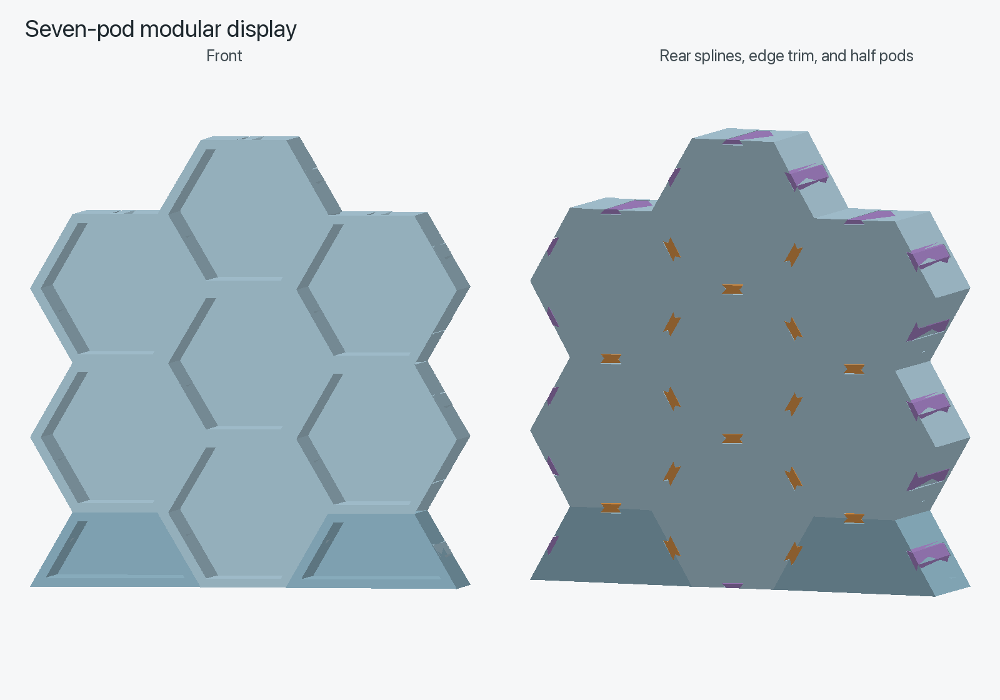
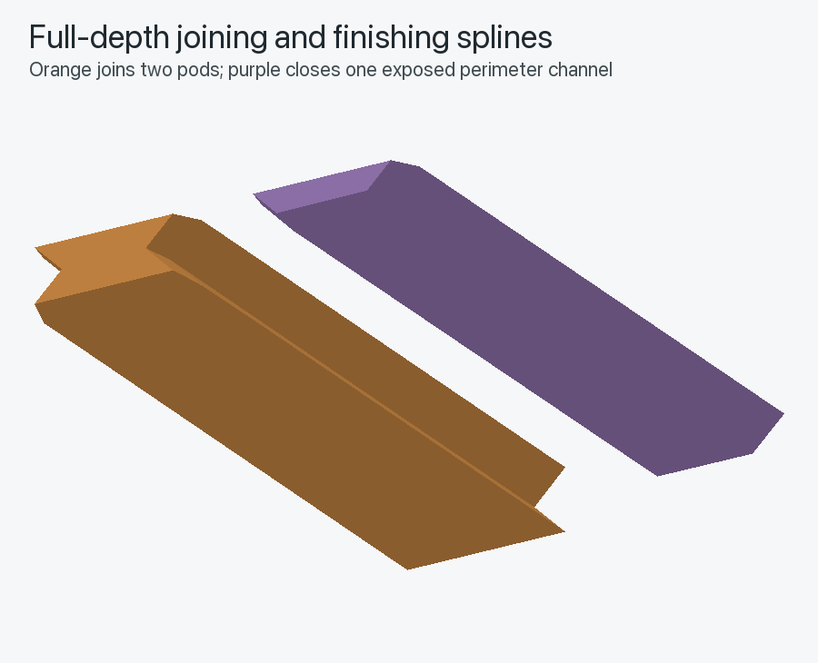

# Modular Honeycomb Mini-Figure Display

A compact, 3D-printable display for miniature figures up to about 1 inch (25.4 mm) tall. Individual backed hexagonal pods can be combined into custom honeycomb arrangements and locked together with removable, full-depth dovetail splines.



## Design

Each full pod has a flush open front and its own solid, flat back. The connector channels run along the pod walls from the rear toward the front. When two pod edges meet, their half-channels form a double-dovetail passage. A joining spline slides into that passage and captures both pods across almost their entire depth, making the front of the assembly substantially more rigid than a rear-only clip.

Unused perimeter channels can be closed with a matching one-sided finishing spline. Its outer face sits flush with the pod edge, while the connector remains hidden 1.6 mm behind the front.



The included half pod fills the staggered gaps along the bottom of a flat-top honeycomb arrangement. Its wide bottom edge sits directly on a desk, eliminating the need for projecting feet.

### Dimensions

| Feature | Dimension |
| --- | ---: |
| Clear opening height | 30.0 mm |
| Clear opening width at center | 34.64 mm |
| Clear interior depth | 19.65 mm |
| Full pod exterior | 39.26 × 34.0 × 22.05 mm |
| Half pod exterior | 39.26 × 17.0 × 22.05 mm |
| Wall thickness | 2.0 mm |
| Solid back thickness | 2.4 mm |
| Spline engagement length | 20.45 mm |
| Uninterrupted front stop | 1.6 mm |

The compartment is 6.35 mm (1/4 inch) shallower than the original deep-pod design.

## Printable files

All generated files are in [`generated/`](generated/).

| File | Purpose |
| --- | --- |
| [`hex_pod.stl`](generated/hex_pod.stl) | Universal full-size compartment |
| [`half_pod_base.stl`](generated/half_pod_base.stl) | Flat-bottom half compartment |
| [`joining_spline_standard.stl`](generated/joining_spline_standard.stl) | Recommended connector for two adjacent pods |
| [`joining_spline_tight.stl`](generated/joining_spline_tight.stl) | Tighter joining-spline fit |
| [`joining_spline_loose.stl`](generated/joining_spline_loose.stl) | Looser joining-spline fit |
| [`finishing_spline_standard.stl`](generated/finishing_spline_standard.stl) | Recommended trim for an exposed channel |
| [`finishing_spline_tight.stl`](generated/finishing_spline_tight.stl) | Tighter finishing-spline fit |
| [`finishing_spline_loose.stl`](generated/finishing_spline_loose.stl) | Looser finishing-spline fit |
| [`spline_fit_test.stl`](generated/spline_fit_test.stl) | Calibration coupon with all three joining fits |
| [`seven_pod_assembly_preview.stl`](generated/seven_pod_assembly_preview.stl) | Assembled reference model; not intended for printing as one piece |

The final 1 mm of each spline is intentionally tapered. Insert this narrower end first.

## Recommended print settings

- PLA
- 0.4 mm nozzle
- 0.20 mm layer height
- 3 walls/perimeters
- 4 top and bottom layers
- 15% gyroid or grid infill
- Supports off
- Optional 0.10–0.20 mm elephant-foot compensation

The files are already in their intended orientations. Print pods with their solid backs on the build plate; print splines flat. The short channel closures are handled as bridges and do not need generated support material.

## Calibrate before printing a set

1. Print [`spline_fit_test.stl`](generated/spline_fit_test.stl) with the same material and slicer profile planned for the display.
2. Keep the three loose splines in order: tight, standard, then loose.
3. Insert the narrower tapered end into a test channel.
4. Select the firmest spline that slides fully into place with steady finger pressure and can still be removed without tools.
5. Print the joining and finishing splines with the matching fit designation.

Start with the standard version. A full-depth sliding fit amplifies small differences in extrusion flow, so do not force a spline that binds.

## Assembly

1. Arrange the pods face-down on a towel with their exterior backs upward.
2. Add half pods beneath any raised bottom columns.
3. Bring neighboring pod edges together.
4. Slide one joining spline, tapered end first, into every shared channel from the rear.
5. Add finishing splines to any exposed perimeter channels you want closed.
6. Stand the assembly upright and confirm that the bottom edges sit evenly on the desk.

Use one joining spline per shared edge. Finishing splines are cosmetic and protective; they do not connect two pods.

## Regenerating the models

The parametric generator is [`src/honeycomb_display.py`](src/honeycomb_display.py). It exposes the compartment dimensions, depth, wall and back thicknesses, channel geometry, lead-in, and fit clearances through `DisplayParameters` near the top of the file.

```bash
python3 -m venv .venv
source .venv/bin/activate
python3 -m pip install -r requirements.txt
python3 src/honeycomb_display.py --output-dir generated
```

Running the generator rewrites the STL files, the two PNG renderings, and [`verification_report.json`](generated/verification_report.json) from the same parameter set.

Run the geometry test suite with:

```bash
PYTHONPATH=src python3 -m unittest -v tests/test_geometry.py
```

## Verification

- All printable STLs are watertight, manifold, consistently wound closed volumes in millimeters.
- Adjacent pods meet without unintended volumetric overlap.
- Joining and finishing splines fit their modeled channels without body collisions.
- The spline taper is checked to prevent crossed or twisted end geometry.
- The complete printable set was successfully sliced in Bambu Studio with a 0.4 mm nozzle, 0.2 mm layers, three walls, 15% infill, and supports disabled.
- Bambu Studio produced no slicing warnings.

Detailed generated checks are available in [`verification_report.json`](generated/verification_report.json) and [`slicer_verification.json`](generated/slicer_verification.json).
